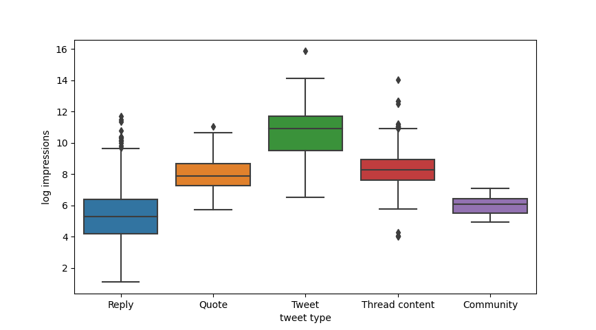
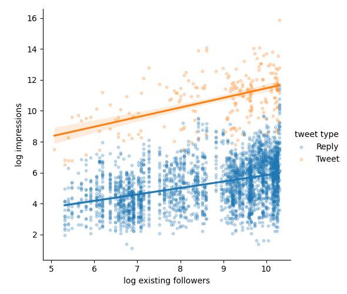

# Analysis of Twitter data

I have a Twitter (now X) account @chaseleantj, and I made 3974 posts from 12 May 2023 to 30 September 2023.

This personal project aims to use data analysis and machine learning to discover interesting insights from the data I've collected from Twitter's analytics page.

The 3974 posts are grouped into 5 categories:

| Category        | Count | Description |
|-----------------|-------|-------------|
| Reply           | 2964  | Replies to other users' tweets |
| Thread content  | 722   | Tweets that are part of a thread |
| Tweet           | 219   | Standalone tweets |
| Quote           | 41    | Tweets that quote other tweets |
| Community       | 28    | Tweets posted in my community |

Below, I'll refer to "posts" to mean all 5 categories, and "tweets", "replies" etc. to mean a specific category of post.

## Findings

### Basic analysis

<ul>
<li>My 219 tweets gained a minimum, median and maximum view count of 219, 56K and 7.8M views respectively, log-normally distributed with a standard deviation of 57K.</li>
<li>Unsurprisingly, the more views a post gets, the more engagement it receives. But as posts get more views, the ratio of likes, replies and user profile clicks to view count decreases (correlation = -0.46, -0.32 and -0.17 respectively). This can be interpreted as popular posts reaching a wider, and hence, less targeted audience.</li>
</ul>

### Clustering

<ul>
<li>Tweets featuring tutorials received the highest amount of engagement and more than 5x the number of views. People love tutorials.</li>
<li>The tutorials that perform the best are those for practical use cases, such as making vector illustrations, comic books and product shots.
<li>Follower milestone celebration tweets had a 10x higher user profile click ratio to impressions vs regular tweets - probably due to the emotional nature of the post. However, they usually have 5x lower impressions.</li>
</ul>

### Regression analysis

<ul>
<li>By simple linear regression with log-log axes, a 1% increase in my follower count increases the mean view count of my tweets by 0.55%, with R-squared=0.26, F(1, 217)=77.54, p=4.19 * 10^-16 and MSE=2.13.</li>
<li>A 1% increase in follower count also increases the mean view count of a reply by 0.39%, with R-squared=0.16, F(1, 2962)=541.6, p=3.64 * 10^-110.</li>

Interestingly, the slope of the regression line of views against followers is steeper for tweets compared to replies. This can have multiple interpretations:

<ul>
<li>I have gotten more skilled at making tweets over time, hence the rate of improvement is more dramatic for tweets compared to replies, or</li>
<li>Having more followers boosts your tweets more than your replies, or</li>
<li>Followers don't boost your replies at all. The only reason the views for replies went up is because those were comments on <em>my own tweets</em> (which got a lot of views). From my observations, this last interpretation is unlikely.</li>
</ul>

Regardless, the relationship between view count and follower count is weak. The content of the post is more important than the follower count of the person posting it. This means that larger accounts do indeed have an advantage, but smaller accounts with good content can have viral posts too.

<li>To support this claim, a deep neural network was trained to predict log views based on a post's text content alone (coverted to a 1536 dimensional-embedding via OpenAI's `text-embedding-ada-002`). It achieved R-squared=0.59, MSE=1.86 on the test dataset, which shows that the content of a post is more closely related to its view count, rather than the follower count of the person who posted it.</li>
<li>Admittedly, the neural network might not be a good approach to perform such a fit - as the dataset is too small relative to the number of features and parameters. An alternative technique to predict the number of impressions with greater accuracy is to first reduce the number of features in the embedding, and use multiple linear regression on both the dimensionally reduced embedding and the follower count.
</ul>

### Takeaways
Ultimately, statistical methods are useful to obtain meaningful information from data. Besides giving an overview of my account, it can provide certain actionable insights:

<ul>
<li>Posts featuring practical tutorials perform the best.</li>
<li>Posts containing announcements, call-to-actions or emotional content get more profile clicks.</li>
<li>An account with 10x more followers can expect up to 3x more views for each post.</li>
</ul>

This analysis was an interesting experience. But it is not a substitute for experience and good judgement of relevant trends when making Twitter posts. It does not take into account the fluctuation in user interests over time, as well as changes to Twitter's algorithm - there have been at least 3 major ones over 5 months. Nor does it consider my skill and understanding of Twitter's platform and audience.